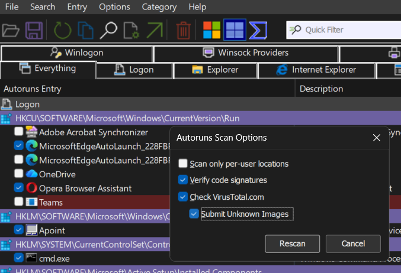
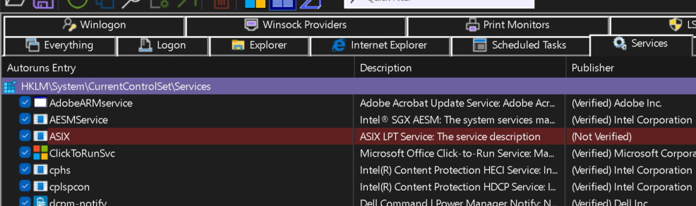
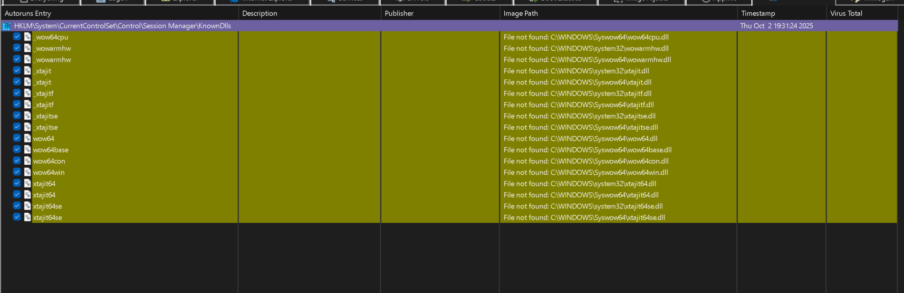
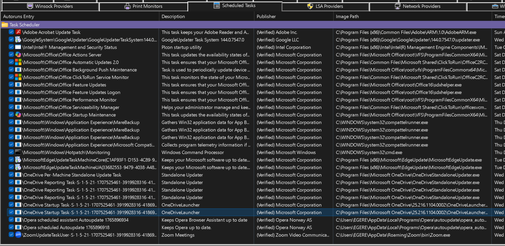

#  WINDOWS SYSTEM SECURITY AUDIT & CLEAN-UP
**Role:** Forensic Analyst / IT Support
**Tools:** Sysinternals Autoruns, Windows Registry, VirusTotal API, Task Scheduler
**Status:** COMPLETED (Dec 18, 2025)

---

## PROJECT DESCRIPTION
My client became aware of the persistent mechanisms used by malware. It was my job to conduct forensic audits, identify potential intrusions, and maintain system stability while removing risks. The following steps demonstrate how I used **Sysinternals Autoruns**, the **Windows Registry**, and **threat intelligence APIs** to perform security-related tasks.

---

## 1. CONFIGURE FORENSIC TOOL FOR TREAT DETECTION
To accurately detect threats, I needed to ensure my analysis tools were configured to filter out noise and cross-reference processes against known threat databases.

**ACTION:**
First, I launched **Sysinternals Autoruns** with administrative privileges to gain full visibility into the system's Autostart Extensibility Points (ASEPs).
* **VERIFY CODE SIGNATURES:** 
I enabled this option to automatically flag any process claiming to be from a vendor but lacking a valid digital certificate.
* **VirusTotal Integration:** I integrated the VirusTotal API to automatically send process hashes to over 70 distinct antivirus databases, checking for known malware signatures instantly.

---

## 2. INVESTIGATE HIGH RISK UNSIGNED SERVICES
A potential security anomaly was flagged in the Services hive. A driver entry was highlighted in **"Red"**, indicating it was unsigned and potentially malicious. This entry needed to be investigated to determine if it was an active threat.

**ROOT CAUSE ANALYSIS:**
I focused my analysis on the **ASIX LPT Service**.
* **Findings:** The driver was unsigned but was identified as a legacy driver for a parallel port component, not active malware.
* **MITIGATION:** Because unsigned drivers present a security risk, I neutralized the threat by **unchecking the entry** to disable the service from starting automatically. This secured the system without permanently deleting a file that might be needed for legacy hardware later.

---

## 3. ANALYZE REGISTRY ANOMALIES AND FALSE POSITIVES
During the scan, several **"Yellow"** entries appeared in the `KnownDLLs` section of the registry. These often indicate missing files, but deleting them incorrectly can cause critical system failures.

**ANALYSIS:**
I investigated the critical "Yellow" registry keys.
* **The Insight:** Using my knowledge of the Windows Registry architecture, I identified that these were **False Positives** caused by the **Windows WoW64 subsystem** (which allows 32-bit apps to run on 64-bit Windows).
* **Decision:** I chose **not to delete** these keys. This prevented a critical system failure that would have resulted from a forced deletion of legitimate system architecture files.

---

## 4. AUDIT SCHEDULED TASK INTEGRITY 
Malware often uses the Windows Task Scheduler to maintain persistence. I needed to verify that all background agents running on the system were legitimate software updates and not malicious scripts.

**VERIFICATION:**
I navigated to the Scheduled Tasks tab to view all configured background agents.
* I inspected entries for common providers (Adobe, Google, Microsoft).
* **VALIDATION:** By verifying the "Publisher" column and checking the VirusTotal score (**0/70 detections**), I confirmed that no unauthorized scripts were scheduled to execute.

---

##  Summary
I conducted a forensic audit of Windows Autostart Extensibility Points (ASEPs) to identify and mitigate security risks. I used **SYSINTERNAL AUTORUNS** and the **Windows Registry** to map the system's attack surface. I integrated the **VirusTotal API** to validate process hashes and applied knowledge of digital signatures to distinguish between legacy drivers and malware.

**OUTCOME:** 0 active intrusions left on the system while maintaining 100% operational stability.
